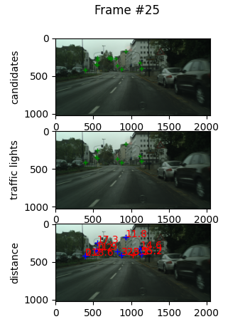

# Mobileye Project - Detect Traffic Lights (ExcellenTeam Bootcamp)
## Team Members:
### Ayelet Weinstock
### Yael Rubin

## Phase 1: Traffic Lights Attention.
### Detected light source in an image using high pass filter and local maxima.

## Phase 2: Traffic Light Detection and Processes data.
### creating data for the tarining. Built and trained CNN in order to determine a traffic light.

## Phase 3: Detect the distance to the traffic light. 
### Measured the geometric distance of each traffic light with SFM and Epipolar Geometry.

## Phase 4: Integration.

## Libraries/Technologies Used:
### * python 3.7
### * numpy
### * matplotlib
### * jupyterlab
### * PIL
### * tensorflow
### * Google colab

## Example:

